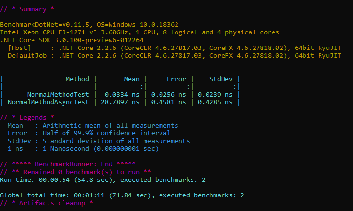
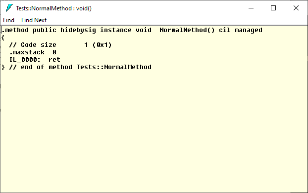
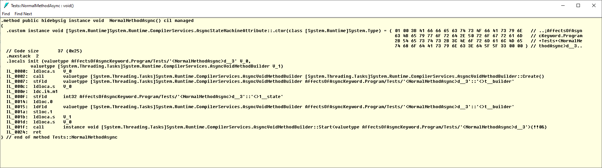
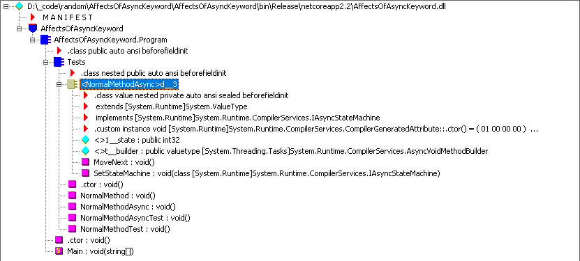

# Affects of doing nothing wrong

This is just a small snippet that demonstrates the little overhead that the async keyword adds, especially not needed when you doing nothing with it or not requiring it because awaiting a Task just to return the value sometimes feels needed by isn't always.

## Benchmark output

Using [benchmark .net](https://benchmarkdotnet.org/index.html) from doing nothing in a regular method to doing nothing in an async method you can see results like below. 

Looking into the IL you'll notice that a bunch of code is setup allowing us to do an await, even if we don't have 1.

Regular void method

Async void method

All objects shown in ildasm.

Although only nano seconds it's just something to keep in mind as eventually all nano seconds add up to a lot more 😅.
